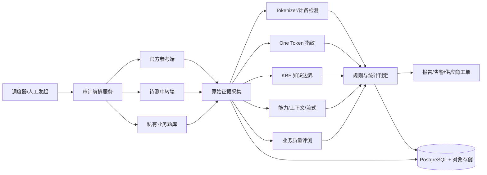

# 中转站模型验真与质量防注水方案

> 版本：v1.1（修订引用出处与许可证信息，补充采样参数覆盖、推理模型适用性、logprobs/seed 信号，细化混合路由验收窗口）  
> 日期：2026-08-20  
> 适用对象：大模型 API 中转站、聚合网关、采购与供应商管理团队

> 当前实施状态：项目现阶段仅在本地 Mock 上验证 API 框架与检测流程，尚未进行真实官方端或中转端测试。下文第 1～2 周涉及的官方基线、端点对照、阈值校准及准确率验收均未开始；接入真实端点前须另行获得明确授权和专用测试凭据。

## 一、执行摘要

本方案建设一套黑盒模型审计系统，在不接触上游模型权重的情况下，持续回答四个彼此独立的问题：

1. **身份一致性**：实际响应是否与宣称模型的官方参考端一致。
2. **服务配置一致性**：是否缩短上下文、降低推理强度、限制输出、关闭工具能力或伪造流式。
3. **质量一致性**：在真实业务任务上的质量是否显著低于官方参考端。
4. **计费一致性**：Token 统计与余额扣减是否存在系统性异常。

系统采用“低成本巡检—行为指纹复核—统计确认—业务质量评测”的分层架构，避免依赖模型自报身份、单道题或单次请求。首期直接复用以下开源项目：

- [Zing](https://github.com/cenbonew/zing)：作为审计外壳和协议、能力、上下文、计费、流式检测框架，Apache-2.0。
- [llm-fingerprint-detector](https://github.com/ToseaAI/llm-fingerprint-detector)：实现 One Token 行为指纹，MIT。
- [KBF](https://github.com/Ooo0ption/KBF)：用知识边界指纹检测模型替换和混合路由，Apache-2.0。
- [GateAPI](https://github.com/Nasan-Duodushu/GateAPI)：复用其 Tokenizer 指纹库和部分探针，Apache-2.0。
- [Ventor-QTest](https://github.com/kexinoh/ventor_qtest)（MIT，腾讯 [AI-Infra-Guard](https://github.com/Tencent/AI-Infra-Guard/tree/main/services/api_checker/ventor_qtest) 内含 vendored 副本）或 [Model Equality Testing](https://github.com/irenasaracay/model-equality-testing)：用于高风险事件的统计复核。

建议以四周完成 MVP：第一周跑通官方端与中转端对照，第二周完成 Tokenizer 和 One Token，第三周接入 KBF 与私有质量集，第四周上线定时巡检、告警和验收测试。

## 二、建设目标与非目标

### 2.1 建设目标

- 对每个“供应商 × 宣称模型 × 接口协议”建立可追溯的官方参考基线。
- 发现整模型替换，例如旗舰模型被换成 mini、flash 或开源模型。
- 发现概率性混合路由，例如 5%、10%、20% 请求被发往低价模型。
- 发现同一模型下的服务降配，例如 reasoning effort 降低、上下文截断、最大输出缩水。
- 发现 Token 使用量、余额扣减、缓存折扣和失败请求计费异常。
- 输出可复查的原始证据、统计结论和置信度，而不是只有一个黑盒评分。

### 2.2 非目标

- 不声称从黑盒响应中获得密码学意义的模型身份证明。
- 不根据一次异常直接认定供应商欺诈。
- 不承诺仅凭 Tokenizer 识别具体模型版本；共享 Tokenizer 的模型只能识别到家族或兼容性层面。
- 不用公开 benchmark 代替真实业务质量测试，避免训练数据污染和供应商针对性优化。

## 三、威胁模型

| 编号 | 风险 | 典型表现 | 主要检测手段 |
|---|---|---|---|
| T1 | 整体模型替换 | 模型名仍为旗舰，实际请求转给更便宜模型 | One Token、KBF、统计同一性检验 |
| T2 | 概率性混合路由 | 正常时给真模型，高峰或部分请求给便宜模型 | 滑动窗口、端点自一致性、KBF、随机时段抽查 |
| T3 | 同模型服务降配 | 推理强度降低、量化、系统提示词注入、输出截断 | 私有质量集、输出/推理 Token、能力探针、分布漂移 |
| T4 | 上下文或能力虚标 | 宣称 128K/1M，实际在 32K 截断；工具调用不可用 | Needle 探针、二分搜索、工具与 JSON Schema 探针 |
| T5 | 计费注水 | usage 虚高、失败请求扣费、缓存折扣未兑现 | Tokenizer 斜率、独立计数、账户余额前后对账 |
| T6 | 假流式与响应篡改 | 完整生成后重新切块；URL、包名或工具参数被改写 | 首包时间、块间隔、已知答案 Canary |
| T7 | 针对审计规避 | 识别固定探针后只对探针返回真模型 | 探针改写、题库轮换、随机调度、混入普通流量 |

## 四、总体架构



### 4.1 推荐技术栈

- 审计编排：Python 3.11、FastAPI、`asyncio/httpx`。
- 定时任务：MVP 使用 APScheduler；规模扩大后改为 Celery/RQ + Redis。
- 数据库：PostgreSQL；完整请求响应和报告附件进入 S3/MinIO。
- 探针实现：Zing 与 KBF 直接采用 Python；One Token 首期调用本地 TypeScript CLI，稳定后封装成独立 Worker。
- 可视化：首期复用 Zing Web UI；后续接入现有运营后台。
- 密钥：环境变量仅限开发；生产使用 KMS/Vault，日志只保存密钥标识，不保存明文。

## 五、基线登记

任何高置信度判断都依赖可信参考端。每个基线必须绑定：

- 官方供应商、官方 Base URL、实际模型 ID。
- 接口协议及版本，例如 Chat Completions、Responses、Anthropic Messages。
- 区域、账号层级、请求参数、系统提示词、工具定义。
- `temperature`、`top_p`、`seed`、reasoning 配置和最大输出。
- 采集时间、探针版本、代码提交 SHA。
- 至少两次不同时间段的官方采集结果，用来估计正常漂移。

参考基线有效期建议为 14 天；若官方发布模型更新、指纹漂移或同型号自一致性明显改变，应立即重采。旧基线不能删除，只标记失效，以便回溯供应商历史表现。

## 六、分层检测设计

### 6.1 L0：连接、协议和元数据检查

每次巡检首先执行 3～5 个低成本请求：

- HTTPS、证书、状态码和错误结构是否正常。
- `/v1/models`、响应 `model` 字段、请求 ID 是否稳定。
- Chat、Responses、Messages 协议是否符合宣称。
- `usage` 是否完整，输入、输出、缓存和推理 Token 是否自洽。
- 流式首包时间、块数量和块间隔是否符合真实增量生成。

这些指标容易伪造，只能作为辅助证据，不参与单独定罪。

### 6.2 L1：Tokenizer 斜率与计费检查

#### 探针构造

选取至少六类单元，对每个单元分别重复 `k = 0、1、2、4、8` 次：

1. 中文及生僻汉字。
2. 英文单词和长复合词。
3. Emoji 与 ZWJ 组合。
4. JSON、代码符号、空格和换行。
5. UUID、URL、长数字和 Base64。
6. 中英日韩混排。

对每一类拟合：

```text
prompt_tokens(k) = 固定协议开销 + k × tokenizer_slope + residual
```

固定系统提示词和 Chat 包装的影响主要进入截距，斜率向量用于与官方端及候选 Tokenizer 比较。候选本地实现采用 [tiktoken](https://github.com/openai/tiktoken)、[Hugging Face Tokenizers](https://github.com/huggingface/tokenizers) 和 SentencePiece。

#### 判定

- 拟合质量低于 `R² = 0.98`：标记为计数不稳定或协议包装随请求变化，进入复核。
- 斜率距离阈值不写死，使用官方基线多轮结果的 `median + 3 × MAD` 建立正常区间。
- 完成 Token 数用本地候选 Tokenizer 重新计数，并与 `usage.completion_tokens` 对比。
- 同时记录账户余额变化；只有 `usage` 与余额两条链路一致异常，才判为高置信度计费不一致。

#### 局限

中转站可以伪造 `usage`，也可以使用正确 Tokenizer 计费、但把请求发给另一个模型。因此本层只能证明“Token 统计与参考不一致”，不能单独证明模型替换或计费欺诈。

### 6.3 L2：One Token 行为指纹

采用论文 [One Token Is Enough](https://arxiv.org/abs/2607.10252) 及本地项目 `llm-fingerprint-detector`：

- 默认使用 8 个“任务 × 语言”单元。
- 每单元 25 次，共约 200 次低输出请求。
- `temperature = 1.0`，固定最小系统提示词，关闭隐藏推理。
- 对答案规范化后形成经验分布，计算逐单元 Jensen-Shannon Divergence，再求均值。

两个前提必须先排除，否则会产生误报：

- **采样参数可能被中转端覆盖**。部分中转会强制改写 `temperature`、`top_p` 或注入采样惩罚，这会直接扭曲单 Token 分布。校准阶段应在官方端采集多个 temperature 档位（如 0.2/0.7/1.0）的自对照指纹；若待测端分布落在同模型其他 temperature 档位内，优先判为“参数被覆盖”而非“模型被替换”，两者的处置和定性完全不同。
- **推理模型适用性受限**。o 系列等模型会忽略 `temperature` 或无法关闭隐藏推理，单 Token 分布的判别力和成本都与普通模型不同。此类模型需单独校准阈值；无法校准的直接标记该检测器为 `unverifiable`，由 KBF 和业务质量集承担身份判定。

首期采用项目默认分段，但报告中必须注明阈值来源：

| mean JSD | 初始解释 |
|---|---|
| `≤ 0.25` | 与参考相符 |
| `0.25～0.35` | 不确定，增加样本并刷新参考 |
| `> 0.35` | 与参考不符 |

上线前用自有官方端数据重新校准。每个模型至少采集 10 组“官方对官方”样本，并用已知替换端构造负样本，目标是在自身业务条件下确定阈值，而不是永久依赖论文的总体阈值。

额外记录 split-half JSD。如果一次审计的前后半段彼此差异异常，优先怀疑多后端轮转、模型热更新或采样不稳定。

#### 补充信号：logprobs 与 seed

若目标端支持 `logprobs`，应优先采集：top-k 对数概率分布比 top-1 采样结果的信息量高一个数量级，能用更少请求达到同等判别力，且伪造成本远高于伪造文本。同理，支持 `seed` 的端点可用固定 seed + `temperature = 0` 做确定性对比。两者都只在“支持时加分”，不支持不算异常——很多官方端同样不提供或不保证。

### 6.4 L3：KBF 知识边界指纹

采用 [KBF](https://arxiv.org/abs/2605.29524) 的参考探针和二项检验：

- 使用官方端为每个模型登记稳定的“会答对/稳定答错”边界题。
- 待测端重复执行同一冻结题集。
- 按项目结果输出 `SAME / DIFF / UNDETERMINED`，保留单题回答和统计量。
- 多题同时检验时使用 Benjamini-Hochberg 控制 `FDR ≤ 0.05`。
- 对混合路由，按 100～500 个请求的滑动窗口运行，估计异常比例及 Bootstrap 置信区间。

KBF 与 One Token 的证据来源不同：前者观察知识边界，后者观察低成本输出偏好。两者同时异常时，身份不一致的可信度明显高于任一单测。

### 6.5 L4：上下文、能力和服务配置

#### 上下文

- 在不同位置放置随机 Canary，执行 Needle-in-a-Haystack。
- 使用 8K、16K、32K、64K、128K 等长度逐级探测；首次失败附近二分搜索。
- 输入内容应随机生成，避免被缓存或被基于关键词的 RAG 旁路识别。
- 连续三次失败且官方端同条件成功，才认定上下文能力缩水。

#### 工具与结构化输出

- Function Calling：固定函数名、枚举参数、必填字段和嵌套对象。
- JSON Schema：测试严格模式、拒绝额外字段、长结构保持能力。
- 多轮状态：第二轮引用第一轮生成的随机值。
- 视觉和音频模型分别检查尺寸、格式、内容相关性及重复输入一致性。

#### 推理与输出配置

- 比较最大可生成 Token、finish reason、可见/隐藏推理 Token 和首包时间。
- 用同一批可自动评分的推理题，对官方端与中转端进行成对随机实验。
- 仅凭响应更短或更快不能认定降智，必须结合正确率或任务成功率下降。

### 6.6 L5：私有业务质量评测

指纹只能检测“像不像”，不能完整回答“质量有没有下降”。每个主要模型建立 100～300 道私有题，建议按真实流量比例分层：

- 结构化抽取：字段级 F1、JSON 合法率。
- 代码任务：隐藏单元测试通过率。
- 数学与逻辑：最终答案准确率；不依赖另一个模型主观打分。
- 工具调用：参数正确率、完整任务成功率。
- 长上下文：目标信息召回率和位置鲁棒性。
- 客服或写作：采用盲测成对偏好，并报告评审一致性。

执行时将官方端和中转端请求随机交错，避免时间、负载和上游版本差异。对随机任务每题至少运行三次，并使用 paired bootstrap 计算质量差值的 95% 置信区间。

默认业务判定建议：若中转端相对官方端下降超过业务容忍度（初始可设 5%），且 95% 置信区间完全落在负向区域，则判为质量退化；最终阈值由业务 SLA 确认。

### 6.7 L6：高风险统计复核

对于准备冻结供应商、索赔或公开说明的事件，再运行：

- [Ventor-QTest](https://arxiv.org/abs/2608.16391)：待测端只需返回文本，通过重复请求重建类别分布，同时评估平均和极端保真度损失。
- [Model Equality Testing](https://arxiv.org/abs/2410.20247)：对官方端和黑盒 API 做二样本同一性检验。

该层成本较高，不用于高频巡检。所有请求、响应、参数、时间戳、代码版本和原始统计结果必须固化并计算 SHA-256。

## 七、调度策略与请求预算

| 频率 | 检测内容 | 典型请求量 | 目的 |
|---|---|---:|---|
| 每 5 分钟 | 连通性、协议、短 Canary | 3～5 | 可用性监控 |
| 每 6 小时 | Tokenizer、usage、流式、工具能力抽样 | 30～60 | 低成本配置巡检 |
| 每天 | One Token 8×25 | 约 200 | 身份与分布漂移 |
| 每周 | KBF、上下文、完整能力集 | 视题集而定 | 混合路由与深度复核 |
| 每两周/模型更新后 | 官方基线刷新、私有质量集 | 200～1000+ | 更新基线和质量 SLA |
| 异常触发 | One Token 加样本、KBF、统计复核 | 动态 | 降低误报 |

成本计算不能只统计调用次数，应按官方和中转两侧分别累计：

```text
审计成本 = Σ(输入 Token × 输入单价 + 输出 Token × 输出单价)
         + 长上下文探针成本
         + 私有质量集重复采样成本
```

系统应支持每模型每日预算上限。超出预算时保留低成本巡检，推迟非紧急深度检测，但高风险异常复核不应被静默跳过。

## 八、结果判定

不要把全部指标压成不可解释的单一总分。最终报告固定输出以下五条结论：

```json
{
  "identity_consistency": "pass|uncertain|fail",
  "routing_consistency": "pass|suspected_mixture|fail",
  "configuration_fidelity": "pass|degraded|fail",
  "quality_delta": {"value": -0.073, "ci95": [-0.101, -0.044]},
  "billing_consistency": "pass|unverifiable|anomaly"
}
```

### 8.1 告警规则

| 等级 | 条件 | 动作 |
|---|---|---|
| PASS | 所有强信号在基线范围内 | 归档 |
| WARN | 单个弱信号异常，或一次 One Token/KBF 不确定 | 24 小时内自动复测 |
| HIGH | 两种独立强信号异常，且在两个时间窗口复现 | 通知运营，暂停新增流量，联系供应商 |
| CRITICAL | 身份异常同时伴随质量/计费/上下文显著退化 | 切换备用上游，冻结结算，人工复核证据 |

强信号包括 One Token、KBF、统计同一性检验和成对业务质量退化；`model` 字段、自我介绍、延迟和单次知识题属于弱信号。

### 8.2 混合路由判定

满足以下任意两项时标记 `suspected_mixture`：

- One Token split-half 或多个滑动窗口之间显著不一致。
- KBF 异常只在部分时间窗口出现，且异常率稳定高于官方自误差。
- 响应特征聚成两个以上稳定簇，并与时间、并发或请求大小相关。
- 私有题同一输入出现双峰质量分布，而官方参考端无此现象。

混合比例必须给出置信区间，不能只报告单点估计。

## 九、数据模型与证据留存

最小数据表如下：

- `providers`：供应商、结算主体、合同和联系人。
- `endpoints`：Base URL、协议、宣称模型、密钥引用。
- `baselines`：官方端、模型版本、采集条件、有效期。
- `probe_sets`：探针版本、内容哈希、适用模型和许可证。
- `audit_runs`：调度时间、代码 SHA、总体状态和预算。
- `request_samples`：脱敏请求、响应、usage、延迟、流式时间戳、请求 ID。
- `signal_results`：检测器、统计量、阈值、置信区间、判定。
- `incidents`：异常时间线、复测结果、供应商反馈和最终处置。

涉及用户数据时，审计系统只使用合成题或已脱敏、已授权的业务样本。原始证据按内部安全等级设置保存期限，报告中不得暴露 API Key、用户内容或完整系统提示词。

## 十、对抗规避设计

- 每类探针准备至少 20 个语义等价改写，运行时随机选择。
- 随机化运行时段、请求顺序、并发量和非关键参数。
- 将少量审计请求分散到正常流量时段，避免固定午夜巡检。
- 定期替换私有题和 Canary；旧题保留用于历史可比性，但不长期单独使用。
- 不向供应商暴露完整题库和准确告警阈值。
- 对公开项目中的默认探针只用于 POC；生产必须加入私有探针。
- 记录出口区域和网络条件，避免把区域路由差异误判为模型替换。

## 十一、实施计划

### 第 1 周：POC 和基线

- 部署 Zing，接通一个官方端和一个待测中转端。
- 定义统一 Endpoint Adapter，跑通 Chat/Responses/Anthropic 三类协议中的实际目标协议。
- 建立 PostgreSQL 最小表和原始 JSON 证据目录。
- 选择两个代表模型，完成两轮官方基线登记。

交付物：可重复执行的 `compare` 报告、基线登记表、请求成本统计。

### 第 2 周：Tokenizer 与 One Token

- 实现六类 Tokenizer 斜率探针及独立计数。
- 将 `llm-fingerprint-detector` 接入任务编排。
- 完成至少 10 组官方自对照和 5 组已知替换对照。
- 校准自身阈值，禁止直接把社区预置指纹作为唯一参考。

交付物：Tokenizer 向量、One Token 指纹库、初版阈值和误报统计。

### 第 3 周：KBF 与业务质量

- 接入 KBF，登记重点模型的知识边界参考集。
- 建立 100～300 道私有业务题和自动评分器。
- 实现官方/中转随机交错、重复采样和 Bootstrap 置信区间。
- 模拟 5%、10%、20%、50% 混合路由，验证检测能力。

交付物：混合路由实验报告、质量差值报告、复核流程。

### 第 4 周：生产化

- 上线定时任务、预算控制、Webhook 和运营后台入口。
- 完成密钥托管、日志脱敏、证据哈希和访问权限。
- 演练高风险告警、备用上游切换和供应商工单流程。
- 通过验收后，先覆盖高价和高流量模型，再逐步扩展。

交付物：生产 MVP、值班手册、供应商异常报告模板和验收记录。

### 人员建议

- 后端工程师 1 人：编排、协议适配、数据库、调度和告警。
- 算法/测试工程师 1 人：探针、统计校准、私有题和对抗实验。
- 运营或采购兼职：SLA、供应商沟通、结算对账和处置决策。

### 首日 POC 操作清单

先运行通用审计，不修改任何开源项目代码：

```bash
python3 -m venv .venv-audit
source .venv-audit/bin/activate
pip install zing-audit

export RELAY_AUDIT_KEY='待测中转端密钥'
export OFFICIAL_AUDIT_KEY='官方参考端密钥'

zing compare \
  --target-base-url 'https://relay.example.com/v1' \
  --target-api-key env:RELAY_AUDIT_KEY \
  --target-model 'gpt-4o-mini' \
  --baseline-base-url 'https://api.openai.com/v1' \
  --baseline-api-key env:OFFICIAL_AUDIT_KEY \
  --baseline-model 'gpt-4o-mini' \
  --suite standard
```

再运行当前目录已有的 One Token 实现：

```bash
cd llm-fingerprint-detector
npm ci
npm test

export OFFICIAL_FINGERPRINT_KEY='官方参考端密钥'
export RELAY_FINGERPRINT_KEY='待测中转端密钥'

node dist/cli.js fingerprint \
  --base-url 'https://api.openai.com/v1' \
  --model 'gpt-4o-mini' \
  --api-key-env OFFICIAL_FINGERPRINT_KEY \
  --out '../gpt-4o-mini.official.fingerprint.json'

node dist/cli.js verify \
  --base-url 'https://relay.example.com/v1' \
  --model 'gpt-4o-mini' \
  --api-key-env RELAY_FINGERPRINT_KEY \
  --reference '../gpt-4o-mini.official.fingerprint.json'
```

POC 阶段只使用测试额度和专用密钥。命令历史可能保存环境变量赋值，因此生产环境应改用 Vault/KMS 注入，且不要把真实密钥写进配置、报告或 Git。

## 十二、验收标准

使用自建路由器构造可控实验，不依赖供应商配合：

1. **同模型稳定性**：官方端对官方端重复测试，强信号误报率不高于 5%。
2. **已知替换**：对选定的旗舰→低价模型替换组合，综合检测召回率达到 90% 以上。
3. **混合路由**：对 10% 已知混合比例，在累计 7 天巡检数据（约 1400 次 One Token 请求加每周 KBF）内检测率达到 80% 以上；报告比例置信区间。低于 5% 的混合比例在此预算下统计功效不足，不作为 MVP 验收项，应在报告中明示检测下限。
4. **上下文缩水**：将 128K 人为截断为 32K，连续三轮均能定位到正确数量级。
5. **计费异常**：人为将 usage 和余额扣减增加 10%，系统能区分“usage 异常”“余额异常”和“两者同时异常”。
6. **假流式**：完整响应缓冲后重切块，系统能通过首包时间和块间隔标记风险。
7. **可追溯性**：任一告警都能还原请求参数、原始响应、探针版本、代码 SHA 和统计过程。
8. **安全性**：日志、报告、告警消息中无明文 API Key 和未脱敏用户内容。

上述数值是 MVP 验收目标，不代表对所有模型的理论保证。若某一模型天然不适合某类探针，应将其标记为 `unverifiable`，而不是强行给出 PASS。

## 十三、供应商处置流程

1. 第一次异常只创建内部事件，不立即定性。
2. 使用新会话、不同时间窗口和刷新后的官方基线复测。
3. 至少两类独立强信号复现后，向供应商提供脱敏证据并要求解释。
4. 在供应商回应期间限制新增流量，但保留小流量用于复测。
5. 若身份异常同时伴随质量或计费异常，自动切换备用上游并冻结争议账单。
6. 事件关闭时记录根因：官方更新、区域差异、配置错误、混合路由、模型替换、计费错误或无法确认。

所有对外表述均应使用“与参考端统计不一致”“存在服务配置退化证据”等可验证措辞，避免把一次黑盒异常直接表述为欺诈事实。

## 十四、复用项目清单

| 项目 | 本方案用途 | 许可证/注意事项 |
|---|---|---|
| [Zing](https://github.com/cenbonew/zing) | 审计框架、协议、上下文、能力、计费、流式、Web UI | Apache-2.0；项目较新，生产前验证每个检测器 |
| [llm-fingerprint-detector](https://github.com/ToseaAI/llm-fingerprint-detector) | One Token 指纹、JSD、CLI/Node 库 | MIT；重要模型应自行采集官方参考 |
| [KBF](https://github.com/Ooo0ption/KBF) | 知识边界和混合路由检测 | Apache-2.0；参考集会随模型更新漂移 |
| [GateAPI](https://github.com/Nasan-Duodushu/GateAPI) | Tokenizer 数据库和功能探针 | Apache-2.0；不要直接照搬综合评分 |
| [Ventor-QTest](https://github.com/kexinoh/ventor_qtest) | 高风险事件统计复核 | 上游为 MIT；腾讯 [AI-Infra-Guard](https://github.com/Tencent/AI-Infra-Guard/tree/main/services/api_checker/ventor_qtest) 内含 vendored 副本，引用时以上游为准。目标端无需 logprobs；参考构建和长序列成本较高 |
| [Model Equality Testing](https://github.com/irenasaracay/model-equality-testing) | 官方端与待测端二样本同一性检验 | 仓库未附 LICENSE，商用前确认授权或按论文（arXiv:2410.20247）独立实现；适合离线复核，需按业务任务设计样本 |
| [B3IT](https://github.com/timothee-chauvin/token-efficient-change-detection-llm-apis) | 低 Token 持续变化检测 | 论文为 arXiv:2602.11083；仓库未见明确 LICENSE，商用前确认授权或独立实现 |

## 十五、最终建议

MVP 不需要重新发明完整系统。最短落地路径是：

1. **以 Zing 为外壳**，先获得协议、上下文、能力、流式、计费和报告能力。
2. **接入当前目录中的 `llm-fingerprint-detector`**，为重点模型建立官方 One Token 指纹。
3. **实现私有 Tokenizer 斜率探针**，GateAPI 数据库只作为候选参考。
4. **用 KBF 复核身份和混合路由**，并用私有业务集判断是否真的降智。
5. **高风险事件再调用 Ventor-QTest 或 Model Equality Testing**，形成能交给供应商和采购团队复核的证据包。

第一期应优先覆盖“价格最高、流量最大、替换收益最高”的 5～10 个模型；运行两周并完成阈值校准后，再扩展全量模型。这样既能控制官方基线成本，也能最快产生实际风控收益。
